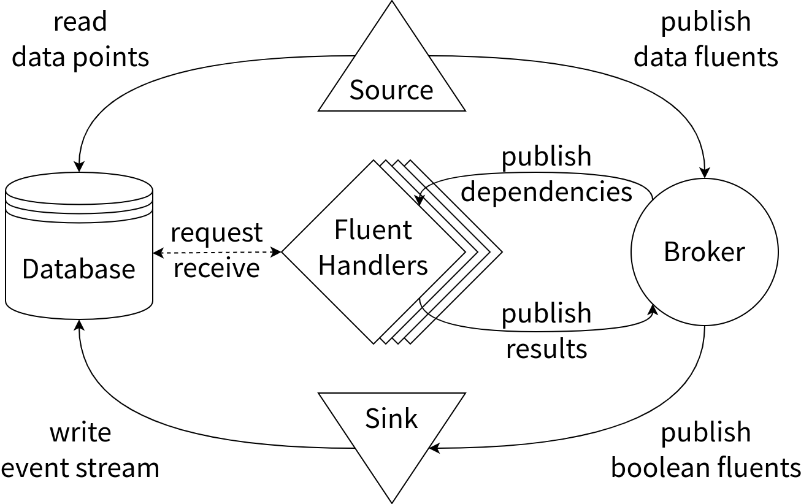

# magritte

_Ceci n'est pas une pipe._

> An implementation of a logic-based time series analysis approach.

Following the pattern of visual dichotomy created by René Magritte in his
famous painting, `magritte` is a pipeline but it is also not. It is a pipeline
because it receives a data stream and produces an event stream (which is also a
data stream), but it is not for its architecture is a publisher-subscriber
mechanism.


## What else is it not?

Unless you are interested for the purpose of learning, this is not something
you should be looking at.


## Background

Analyzing time series data is an active field of research and engineering. A
number of methods and approaches exist and can be very roughly categorized as
follows, according to the author's perspective:

- classic approaches (rooted in signal processing)
- statistics based approaches (pure statistics, machine learning, ...)
- logic based approaches (event based or event driven, capable of composing
    expressions, etc.)

Most systems which have been created for the purpose of enabling time series
data analysis are some mixture of the above as a pure implementation seems all
but impossible. The different approaches are usually most applicable at
different stages of the process.

Using a logical approach in a concurrent way for the analysis stage of the
process is the subject of my Master's thesis, _Concurrent Stream Reasoning for
Complex Event Recognition_. This project here contains the implementation
of the (not-a-)pipeline part of the system.


## Architecture

**magritte** forms part of the overall architecture; specifically, it forms the
functional part, from data acquisition to results storage, but nothing outside
from those responsibilities. This allows for a good separation of concerns and
enables the use of programming languages and technologies better suited for the
respective purposes at both ends of the (not-a-)pipeline.



There is a separate bundle called `barbershop` which contains all the yak
shaving elements to set up some docker containers running the database,
downloading the dataset and preloading it into the database. It has some more
than that, which is explained in its README file.


## Base Technologies

All components of **magritte** are written in the Rust programming language.
The [tokio](https://tokio.rs/) asynchronous runtime is used to implement the
concurrent tasks and scheduling them.


## Build and Run

Building and running **magritte** is as canonical as it gets:

```sh
cargo build
# or
cargo run
# or
cargo run --release
```

Rust and `cargo` documentation is published online. Google is your friend.


---

<div align="center">
  This work is licensed under the Apache License, Version 2.0. You should have
  received a copy of this license along with the source code. If that is not
  the case, please find one <a
  href="http://www.apache.org/licenses/LICENSE-2.0">online</a>.
</div>
